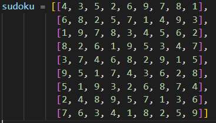
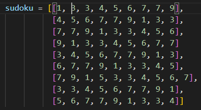

# Sudoku-Validator
My solution to solving a 9x9 sudoku using python

# Starting the application

To start the application simply download the file [sudokuValidator.py] and execute the code. If you have [Visual Studio Code]( https://code.visualstudio.com/) installed all you have to do is press the button [F5], or open the file with Visual Studio, click Run and Start Debugging.

In this validation process there were nine different cases that were reviewed, and I will go through each one of them.

## Use Case 1 - basicGrid


Result: **True**

## Use Case 2 - basicGrid2



Result: **True**

## Use Case 3 - columnError


Result: **False**

## Use Case 4 - outOfRangeError


Result: **False**

## Use Case 5 - outOfRangeError2


Result: **False**

## Use Case 6 - rowError


Result: **False**

## Use Case 7 - rubbishError


Result: **False**

## Use Case 8 - subGridError


Result: **False**

## Use Case 9 - sumValidationError



Result: **False**


# How to read a csv file using the [pandas](https://pandas.pydata.org) library

## Downloading the pandas library
If you want to use the pandas library you have to install it first by either using the  or  installer:

```bash
conda install pandas
```

```bash
pip install pandas
```

## Accessing a .csv file using pandas

To access a file all you have to do is write the code below
```bash
import pandas as pd
sudoku = pd.read_csv("Directory of your csv file")
```
To access a specific column or row:
```bash
df = pd.DataFrame(sudoku)
display(df.iloc[1) # Specific row

column = sudoku.head() # get a column
```
To get a specific cell from the spreadsheet:
```bash
df.iat[0,0] # This will give you the first cell of the grid
```
